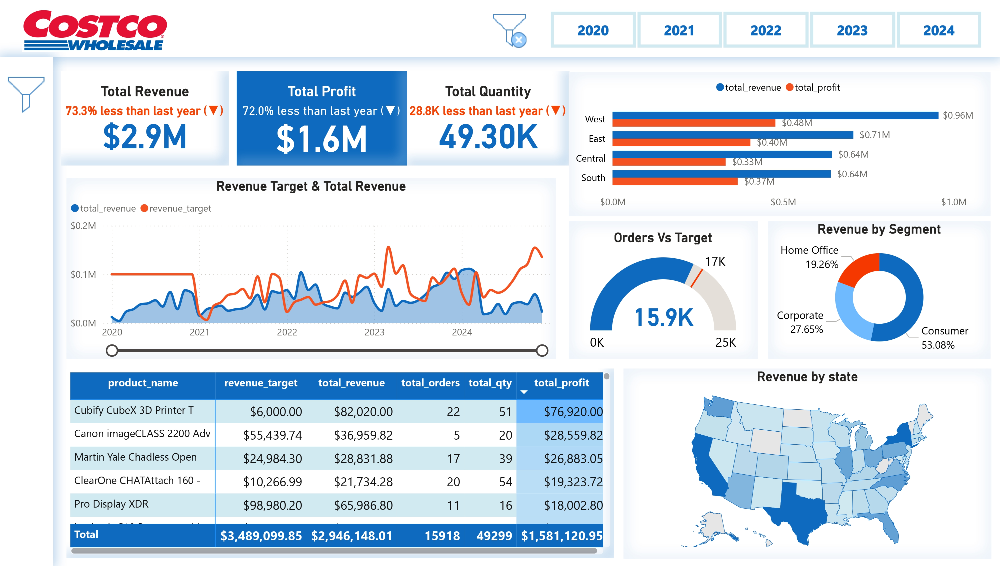
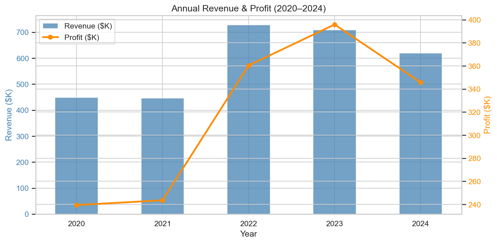
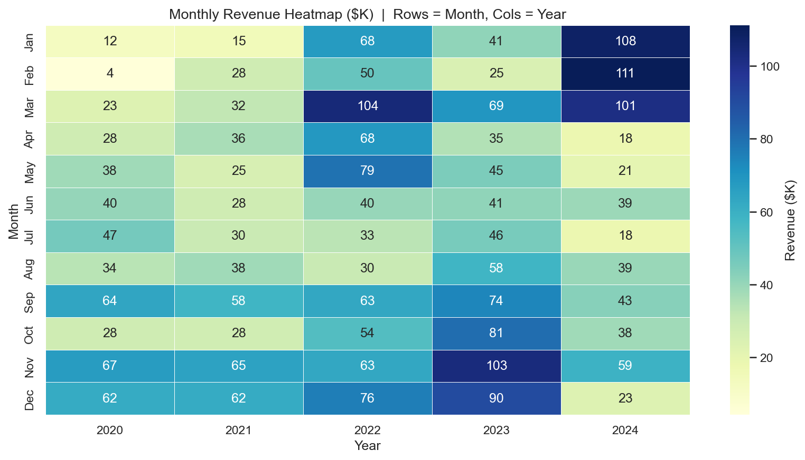
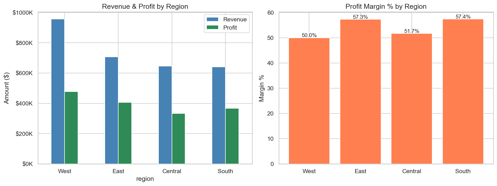
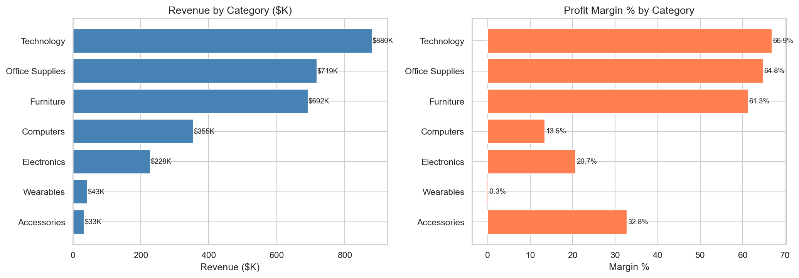
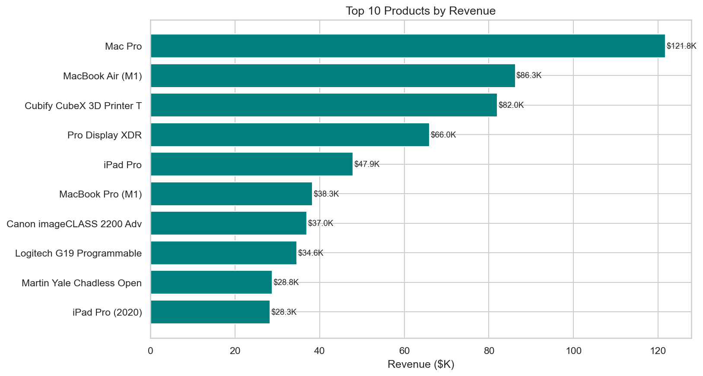
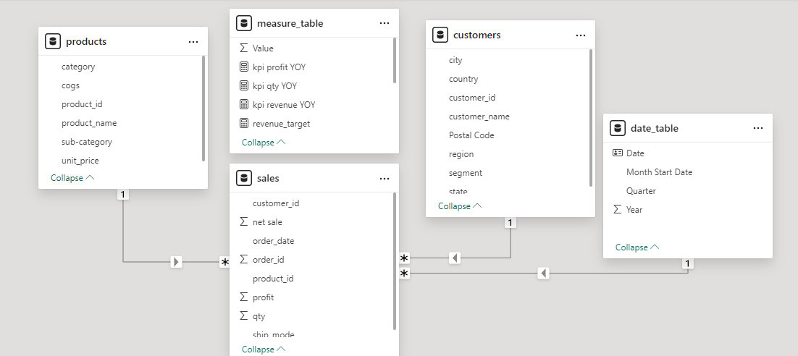

# 🚀 **Power BI Sales Insights Dashboard: 5-Year Detailed Analysis of Costco Global Sales** 📊

    

## 🚀 Project Overview

This project performs a full **Exploratory Data Analysis (EDA)** and solves **critical business problems** using 5 years of Costco global retail sales data (2020–2024). By analyzing **~16,000 order line items** across 793 customers and 1,618 products, the project uncovers revenue trends, identifies customer behavior patterns, and delivers actionable pricing and expansion recommendations — backed by a complete PostgreSQL data layer and an interactive Power BI dashboard.

---

    

👉 **[Explore the Live Dashboard Here](https://app.powerbi.com/view?r=eyJrIjoiZjQ4MTU3NDEtZmRhOS00MGUwLWI0OWUtYzNkNWY1MTU3YWEzIiwidCI6ImE4ZWVjMjgxLWFhYTMtNGRhZS1hYzliLTlhMzk4YjkyMTVlNyIsImMiOjN9)**

---

## 🛠️ Technologies Used

- **PostgreSQL**: Database design, advanced querying, and stored procedures
- **SQL**: Window functions, CTEs, subqueries, and complex aggregations
- **Python**: Pandas, Matplotlib, Seaborn — data cleaning, EDA, and visualizations (`Costco EDA.ipynb`)
- **Power Query**: ETL pipeline — data cleaning, type conversion, multi-file merging, column splitting
- **Power BI**: Interactive dashboard with DAX measures, shape maps, and KPI cards

---

## 💡 What Makes This Project Unique?

- **5-Year Longitudinal Data**: Covers pandemic impact (2020–2021) through post-pandemic recovery (2022–2024), enabling COVID-era trend analysis
- **Triple-Layer Analysis**: Same dataset explored three ways — Python EDA notebook, full SQL data layer, and an interactive Power BI dashboard
- **Python EDA Notebook**: 15-section Jupyter notebook covering data cleaning, missing value analysis, KPIs, monthly heatmaps, and visualizations across all dimensions
- **Full SQL Data Layer**: Schema design, EDA, four tiers of business questions (Easy → Advanced), and reusable stored procedures — not just a dashboard
- **RFM Customer Segmentation**: Champions, Loyal Customers, At Risk, and Lost segments identified using NTILE quintiles across all 793 customers
- **Target vs Actual Tracking**: Dedicated `sales_targets` table enables real-time variance analysis across region × category × quarter
- **Cohort Analysis**: Tracks how each year's new customer cohort retains and grows over subsequent years
- **Interactive Power BI Dashboard**: Region and segment filters, ship mode slicers, YoY KPIs, USA shape map, and product-level drilldown

---

## 📊 Dataset Details

**~16,024 order line items | 793 customers | 1,618 products | 2020–2024**

| Table | Source | Rows | Key Columns |
|---|---|---|---|
| `customers` | customers.csv | 793 | customer_id, segment, region, state |
| `products` | products.csv | 1,618 | product_id, category, unit_price, cogs |
| `orders` | global sales/2020–2024.csv | ~16,024 | order_id, order_date, ship_mode, qty, discount |
| `sales_targets` | Manual / procedure | variable | year, quarter, region, category, target_revenue |

**Segments**: Consumer · Corporate · Home Office  
**Regions**: Central · East · South · West  
**Categories**: Accessories · Computers · Electronics · Furniture · Office Supplies · Technology · Wearables  
**Ship Modes**: First Class · Second Class · Standard Class · Same Day

Revenue = `qty × unit_price × (1 - discount)`  
Profit  = `qty × (unit_price × (1 - discount) - cogs)`

---

## 🐍 Python EDA Notebook

**`Costco EDA.ipynb`** — 15-section Jupyter notebook using Pandas, Matplotlib, and Seaborn.

| Section | What it covers |
|---|---|
| Data Loading | Reads all CSVs with `glob`; stacks 5 yearly sales files into one DataFrame |
| Data Cleaning | Strips `$` and commas from prices, splits `Country-City`, parses dates |
| Dataset Overview | Shapes, dtypes, date range, avg items per order |
| Missing Value Analysis | Bar charts per table — flags any gaps before analysis |
| Duplicate Detection | customer_id, product_id, order+product composite, bad ship dates |
| Merge & Calculations | Joins all 3 tables; computes `net_sale`, `cogs_total`, `profit` |
| Summary KPIs | Revenue, profit, margin %, units, orders, customers |
| Annual Revenue Trend | Dual-axis bar + line chart (revenue vs profit, 2020–2024) |
| Monthly Heatmap | Seaborn heatmap — month × year to surface seasonality |
| Revenue by Region | Grouped bar + margin % side by side |
| Revenue by Segment | Pie chart + grouped bar (Consumer / Corporate / Home Office) |
| Revenue by Category | Horizontal bar revenue + margin % per category |
| Top 10 Products | Horizontal bar with revenue labels |
| Discount Analysis | Histogram + profitable vs loss-making pie chart |
| Shipping Analysis | Orders by ship mode + average fulfilment days |

**Key Python techniques:** `pd.concat` for multi-file loading · `str.strip/replace` for dirty CSVs · `groupby().agg()` · `pivot()` for heatmap · `twinx()` for dual-axis charts · `FuncFormatter` for `$K` axis labels

---

## 📸 EDA Visualizations

> Run `Costco EDA.ipynb` first — charts are auto-saved to the `eda_charts/` folder.

### Annual Revenue & Profit Trend (2020–2024)

### Monthly Revenue Heatmap

### Revenue & Profit by Region

### Revenue & Margin by Product Category

### Top 10 Products by Revenue

---

## 🗂️ SQL File Structure

| File | Purpose |
|---|---|
| `Costco Schema Creation.sql` | DDL for all 4 tables + step-by-step CSV import instructions |
| `Exploratory Data Analysis.sql` | Row counts, NULL checks, duplicate detection, FK validation, distributions |
| `Easy Level Questions.sql` | Overall KPIs, revenue by region/segment/category, annual summary |
| `Medium Level Questions.sql` | Sub-category margins, top customers, monthly trends, discount impact |
| `Difficult Level Questions.sql` | Multi-year loyalty, Pareto, segment-region ranking, market basket |
| `Advanced Questions.sql` | YoY LAG, running totals, RFM, cohort analysis, COVID comparison, CLV |
| `Stored Procedures.sql` | Quarterly report function, target upsert procedure, customer profile, margin flagging |

---

## 💼 Business Problems Solved

### 🔍 1. Data Quality & Exploration
- Validated NULL values, duplicate keys, and FK integrity across all tables
- Flagged orders where `ship_date < order_date` and products where `cogs ≥ unit_price`
- Mapped discount distribution to quantify loss-making order lines

### 📈 2. Revenue & Profit Analysis
- Total revenue: **$2.9M** | Total profit: **$1.6M** | 49.3K units sold
- Region-level and segment-level breakdown with profit margin percentages
- Monthly and quarterly trends reveal consistent Q4 peaks across all years

### 🎯 3. Target vs Actual Performance
- `sales_targets` table tracks per-quarter, per-region, per-category revenue and profit goals
- `upsert_sales_target()` procedure keeps targets current without creating duplicates
- Advanced query surfaces revenue gap and % variance for every tracked combination

### 🛒 4. Dynamic Pricing & Discount Risk
- Identified products selling below cost due to excessive discounting
- Quantified revenue lost to discounts above 40% by category (revenue-at-risk)
- Pareto analysis revealed which products drive 80% of total revenue

### 🤝 5. Customer Segmentation & Retention
- RFM model segments all 793 customers into: Champions, Loyal Customers, Recent, Big Spenders at Risk, Potential Loyalists, Lost Customers
- Cohort analysis tracks how 2020–2023 customer cohorts retain and grow year-over-year
- Loyalty filter surfaces customers active in 3+ distinct years
- 3-year Customer Lifetime Value (CLV) projection ranked across all customers

### 🌍 6. Regional Expansion Insights
- State-level revenue map drives the Power BI USA shape map visualization
- Segment × Region profit matrix identifies highest- and lowest-margin combinations
- YoY revenue growth rate by region (LAG) surfaces fastest- and slowest-growing markets

### 📦 7. Product & Category Performance
- Top 3 products per category using `RANK() OVER (PARTITION BY category)`
- All products ranked by revenue within their category using `DENSE_RANK()`
- Market basket analysis surfaces frequently co-purchased product pairs for cross-sell
- Sub-category margin ranking highlights where to invest vs. where to cut

### 🦠 8. COVID Impact Analysis
- Pandemic (2020–2021) vs post-pandemic (2022–2024) revenue and profit split by region and category
- Reveals which categories recovered fastest and where customer behavior shifted permanently

---

## ⚙️ Key SQL Techniques Demonstrated

- **Window Functions**: `LAG()`, `RANK()`, `DENSE_RANK()`, `ROW_NUMBER()`, `NTILE()`, `SUM() OVER()`, `AVG() OVER()`
- **CTEs**: Multi-step logic broken into readable, reusable query blocks
- **Stored Procedures & Functions**: `RETURNS TABLE`, `UPSERT` with `ON CONFLICT`, parameterized reporting
- **Pivoting**: `CASE WHEN EXTRACT(YEAR...) = x` for the seasonal revenue heatmap
- **Self-Join**: Product co-occurrence / market basket analysis
- **Date Arithmetic**: Shipping lag, cohort year offsets, quarterly date boundary calculation

---

## 🗺️ Entity Relationship Diagram

    

---

## 🚀 Key Highlights

- 🐍 **Python EDA notebook** with 15 sections covering data cleaning, KPIs, and 8 chart types
- 🧮 **~16,000 order lines** across 5 yearly files unified into one PostgreSQL schema
- 📊 **10 advanced SQL queries** using window functions and CTEs for deeper business insight
- 🔁 **4 stored procedures/functions** for quarterly reporting, target tracking, customer profiles, and margin flagging
- 🌎 **Regional expansion analysis** via YoY growth rates and segment × region margin ranking
- 🦠 **COVID era comparison** quantifying pandemic impact on every category and region

---

## 📌 Future Scope

- **Predictive Forecasting**: ARIMA or Prophet model on the monthly revenue series for 2025 projections
- **Inventory Layer**: Add a product inventory table with automated reorder triggers based on sales velocity
- **Real-Time Pipeline**: Connect live POS data via a streaming ETL pipeline to keep the dashboard current
